#Лабораторная работа №5. Создание и процесс обработки программ на языке ассемблера NASM
```
Автор: Волченко Елена
```

##Цель работы
**Цель работы:** Освоение процедуры компиляции и сборки программ, написанных на ассемблере NASM.

##Ход работы
1. **Программа Hello world!**
	1. Создание каталога для работы с программами на языке ассемблера NASM
	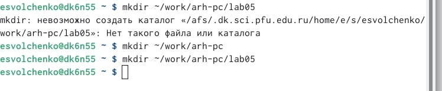{ #fig:001 width=70% }
	2. Переходим в созданный каталог
	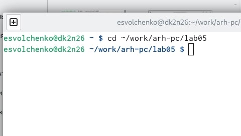{ #fig:001 width=70% }
	3. Создаём текстовый файл с именем hello.asm
	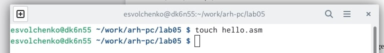{ #fig:001 width=70% }
	4. Открываем этот файл с помощью текстового редактора gedit, вводим текст
	{ #fig:001 width=70% }
	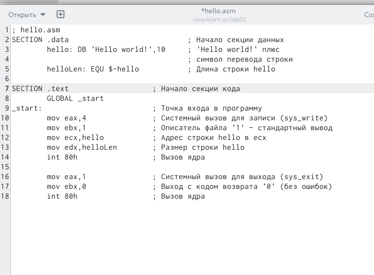{ #fig:001 width=70% }
	
2. **Транслятор NASM** 
	Компилируем текст программы
	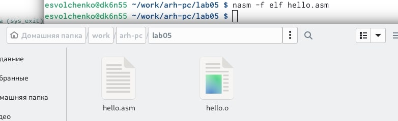{ #fig:001 width=70% }
	
3. **Расширенный синтаксис командной строки NASM**
	Выполняем команду *nasm -o obj.o -f elf -g -l list.lst hello.asm*
	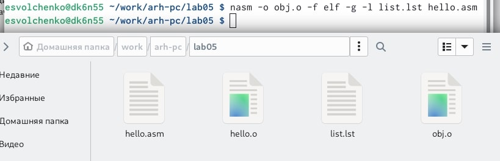{ #fig:001 width=70% }
	
4. **Компоновщик LD**
	1. Передаём объектный файл на обработку компоновщику, проверяем наличие файла
	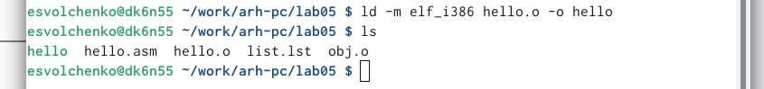{ #fig:001 width=70% }
	2. Выполняем команду *ld -m elf_i386 obj.o -o main*
	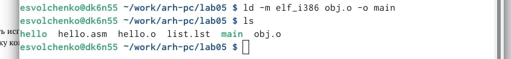{ #fig:001 width=70% }
	
5. **Запуск исполняемого файла**
	Запускаем исполняемый файл 
	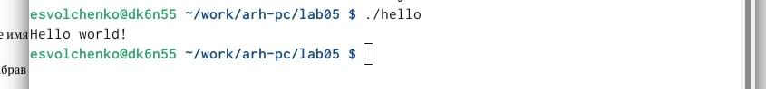{ #fig:001 width=70% }

##Выводы
**Выводы:** во время выполнения этих заданий я ознакомилась с некоторыми командами работы на языке ассемблера NASM.

## Задание для самостоятельной работы
1. В каталоге *~/work/arch-pc/lab05* с помощью команды *cp* создаём копию файла *hello.asm* с именем *lab5.asm*
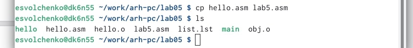{ #fig:001 width=70% }
2. С помощью текстового редактора gedit вносим изменения в текст программы в файле *lab05.asm*
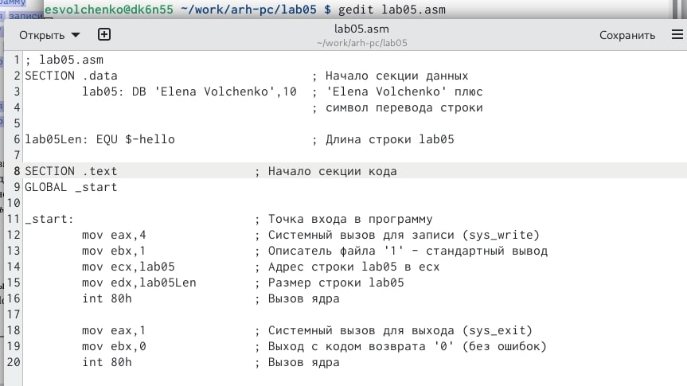{ #fig:001 width=70% }
3. Оттранслируем полученный текст программы *lab05.asm* в объектный файл. Выполням компоновку объектного файла и запускаем получившийся исполняемый файл
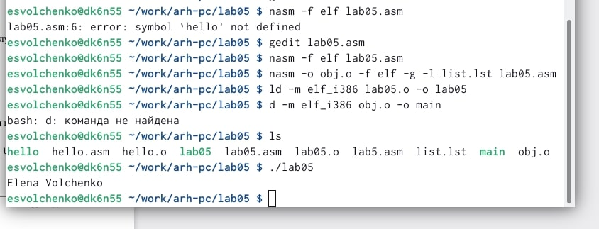{ #fig:001 width=70% }
4. Копируем файлы *hello.asm* и *lab05.asm* в локальный репозиторий в каталог *~/work/study/2022-2023/"Архитектура компьютера"/arch-pc/labs/lab05/*. Загружаем файлы на Github.
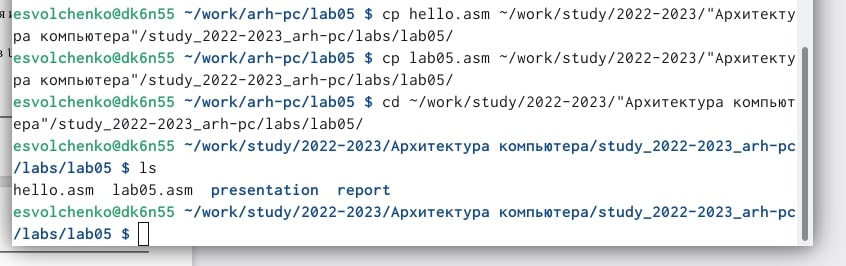{ #fig:001 width=70% }

##Выводы
**Выводы:** выполняя задания для самостоятельно работы, я закрепила полученные знания.

##Общие выводы
Во время выполнения лабораторной работы я освоила процедуры компиляции и сборки программ, написанных на ассемблере NASM.
