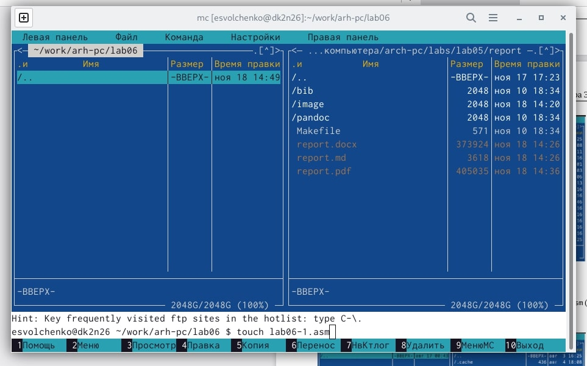

#Лабораторная работа No6. Основы работы с Midnight Commander (mc). Структура программы на языке ассемблера NASM. Системные вызовы в ОС GNU Linux
```
Автор: Волченко Елена Сергеевна
```

##Цель работы
**Цель:** Приобретение практических навыков работы в Midnight Commander. Освоение инструкций языка ассемблера mov и int.

##Ход работы
1. Основная часть
	1. Открываем Midnight Commander
	{ #fig:001 width=70% }
	2. Переходим в каталог *~/work/arch-pc*, созданный при выполнении лабораторной работы №5
	{ #fig:001 width=70% }
	3. С помощью функциональной клавиши *F7* создаём папку *lab06* и переходим в созданный каталог.
	{ #fig:001 width=70% }
	{ #fig:001 width=70% }
	4. Пользуясь строкой ввода и командой *touch* создаём файл *lab6-1.asm*, с помощью функциональной клавиши *F4* открываем файл *lab6-1.asm* для редактирования во встроенном редакторе. у меня это *mcedit*.
	{ #fig:001 width=70% }
	5. Вводим текст программы из листинга 6.1, сохраняем изменения и закрываем файл.
	{ #fig:001 width=70% }
	6. С помощью функциональной клавиши *F3* открываем файл *lab6-1.asm* для просмотра. 
	{ #fig:001 width=70% }
	7. Оттранслируем текст программы *lab6-1.asm* в объектный файл. Выполняем компоновку объектного файла и запускаем получившийся исполняемый файл.
	{ #fig:001 width=70% }
	
2. Подключение внешнего файла in_out.asm
	1. Скачиваем файл *in_out.asm* из ТУИС.
	2. Копируем файл *in_out.asm* в каталог с файлом *lab6-1.asm* с помощью функциональной клавиши *F5*.
	{ #fig:001 width=70% }
	3. С помощью функциональной клавиши *F5* создаём копию файла *lab6-1.asm* с именем *lab6-2.asm*.
	{ #fig:001 width=70% }
	4. Исправляем текст программы в файле *lab6-2.asm* с использованиеи подпрограмм из внешнего файла *in_out.asm* в соответствии с листингом 6.2.
	{ #fig:001 width=70% } 
	5. Создаём исполняемый файл и проверяем его работу.
	{ #fig:001 width=70% }
	6. В файле *lab6-2.asm* заменяем подпрограмму *sprintLF* на *sprint*. 
	{ #fig:001 width=70% }
	7. Создаём исполняемый файл и проверяем его работу. Теперь ввод производится в той же строке.
	{ #fig:001 width=70% }
	
##Выводы
**Выводы:** во время выполения заданий я освоила инструкции языка ассемблера mov и int.

##Задание для самостоятельной работы
1. Создаём копию файла *lab6-1.asm*.
{ #fig:001 width=70% }
2. Вносим изменения в программу, без использования внешнего файла *in_out.asm*, так чтобы она работала по алгоритму: вывести приглашение типа “Введите строку:”; ввести строку с клавиатуры; вывести введённую строку на экран.
{ #fig:001 width=70% }
3. Получаем исполняемый файл и проверяем его работу.
{ #fig:001 width=70% }
4. Создаём копию файла *lab6-2.asm*.
{ #fig:001 width=70% }
5. Вносим изменения в программу, с использования внешнего файла *in_out.asm*, так чтобы она работала по алгоритму: вывести приглашение типа “Введите строку:”; ввести строку с клавиатуры; вывести введённую строку на экран.
{ #fig:001 width=70% }
6. Создаём исполняемый файл и проверяем его работу.
{ #fig:001 width=70% }

##Выводы
**Выводы:** выполняя задания для самостоятельной работы, я закрепила полученные знания.

##Общие выводы
Во время выполнения лабораторной работы я приобрела практические навыки работы в Midnight Commander и освоила инструкции языка ассемблера mov и int.
